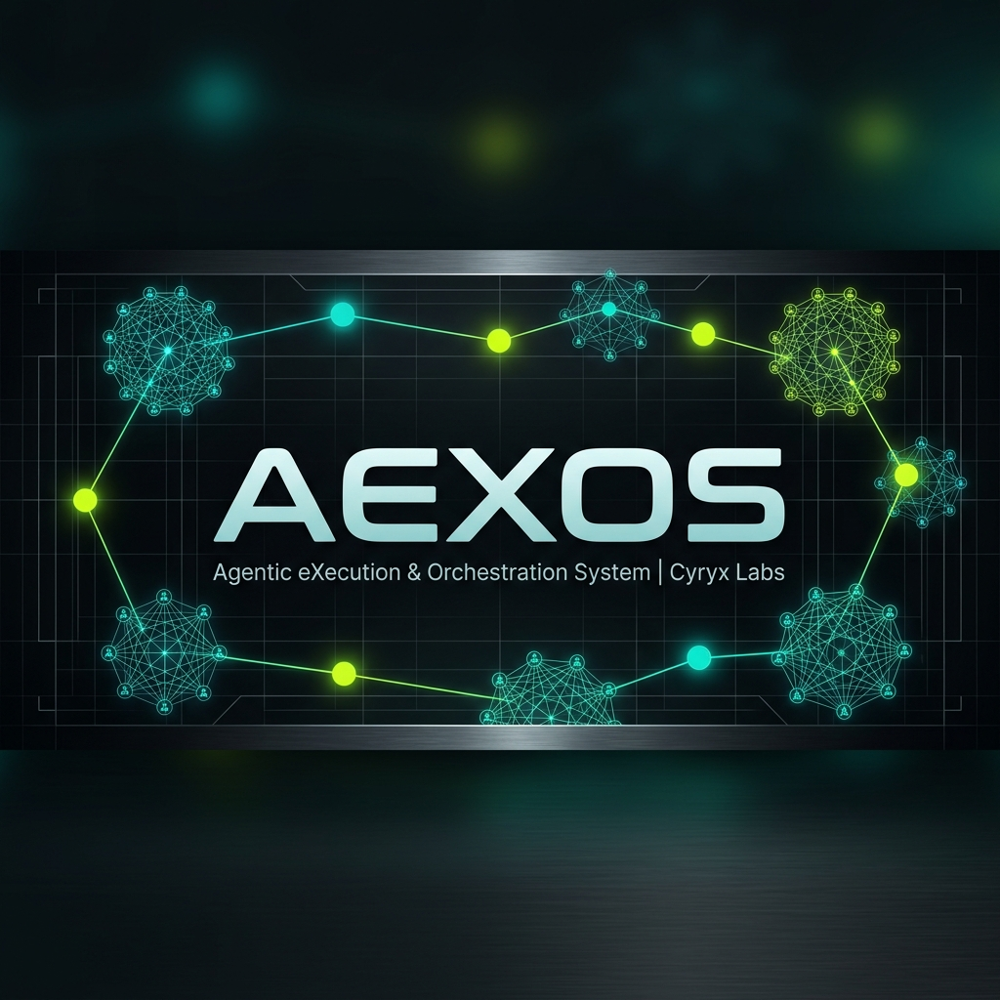

# AEXOS - Agentic eXecution & Orchestration System

<p align="center">
  
</p>

[](https://www.npmjs.com/package/@aexos-squads/core)
[](LICENSE)
[](https://nodejs.org/)
[](https://github.com/CyryxLabs/AEXOS/actions/workflows/ci.yml)
[](https://codecov.io/gh/CyryxLabs/AEXOS)
[](https://cyryxsquad.ai)
[](CONTRIBUTING.md)
[](CODE_OF_CONDUCT.md)

> **Giving people back the power to create** — AI orchestration framework that gives control back to those who dare to build. Specialized agents, workflows, and CLI First experience for any domain.

## Start Here (10 Min)

If this is your first time with CYRYX, follow this linear path:

1. Install in a new or existing project:
```bash
# Run directly via GitHub (no npm publish needed):
npx github:CyryxLabs/AEXOS init my-project

# Or from a local clone:
git clone https://github.com/CyryxLabs/AEXOS.git
cd AEXOS
npm install
npm link
aexos init my-project
```
2. Choose your IDE/CLI and the activation path:
- Claude Code: `/agent-name`
- Gemini CLI: `/aexos-menu` → `/aexos-<agent>`
- Codex CLI: `/skills` → `aexos-<agent-id>`
- Cursor/Copilot/AntiGravity: follow the limits and workarounds in `docs/ide-integration.md`
3. Activate 1 agent and confirm the greeting.
4. Run 1 initial command (`*help` or equivalent) to validate first-value.

First-value definition (binary): agent activation + valid greeting + initial command with useful output in <= 10 minutes.


## IDE Hook Compatibility (CYRYX 4.2 Reality)

Many advanced CYRYX features depend on lifecycle events (hooks). The table below shows the actual parity between IDEs/platforms:

| IDE/CLI | Hook Parity vs Claude | Practical Impact |
| --- | --- | --- |
| Claude Code | Complete (reference) | Maximum context automation, guardrails, and auditing |
| Gemini CLI | High (native events) | Strong coverage of pre/post tool and session automations |
| Codex CLI | Partial/limited | Some automations depend on `AGENTS.md`, `/skills`, MCP, and operational flow |
| Cursor | No equivalent lifecycle hooks | Less pre/post tool automation; focus on rules, MCP, and agent flow |
| GitHub Copilot | No equivalent lifecycle hooks | Less session/tooling automation; focus on repository instructions + MCP in VS Code |
| AntiGravity | Workflow-based (not hook-based) | Integration via workflows, not via hook events equivalent to Claude |

Detailed impacts and mitigation: `docs/ide-integration.md`.

## Overview

### Architectural Premise: CLI First

CYRYX follows a clear priority hierarchy:

```text
CLI First → Observability Second → UI Third
```

| Layer             | Priority  | Focus                                                                          | Examples                                     |
| ----------------- | --------- | ------------------------------------------------------------------------------ | -------------------------------------------- |
| **CLI**           | Highest   | Where the intelligence lives. All execution, decisions, and automation happen here. | Agents (`@dev`, `@qa`), workflows, commands |
| **Observability** | Secondary | Observe and monitor what happens in the CLI in real time.                      | SSE Dashboard, logs, metrics, timeline       |
| **UI**            | Tertiary  | Ad-hoc management and visualizations when needed.                              | Kanban, settings, story management           |

**Derived principles:**

- The CLI is the source of truth - dashboards only observe
- New features must work 100% via CLI before having a UI
- The UI should never be a requirement for system operation
- Observability serves to understand what the CLI is doing, not to control it

---

**The Two Key Innovations of CYRYX:**

**1. Agentic Planning:** Dedicated agents (analyst, pm, architect) collaborate with you to create detailed, consistent PRD and Architecture documents. Through advanced prompt engineering and human-in-the-loop refinement, these planning agents produce comprehensive specifications that go far beyond generic AI task generation.

**2. Engineering-Contextualized Development:** The sm (Scrum Master) agent then transforms these detailed plans into hyper-detailed development stories that contain everything the dev agent needs - complete context, implementation details, and architectural guidance embedded directly in the story files.

This two-phase approach eliminates both **planning inconsistency** and **context loss** - the biggest problems in AI-assisted development. Your dev agent opens a story file with full understanding of what to build, how to build it, and why.

**📖 [See the complete workflow in the User Guide](docs/guides/user-guide.md)** - Planning phase, development cycle, and all agent roles

## Prerequisites

- Node.js >=18.0.0 (v20+ recommended)
- npm >=9.0.0
- GitHub CLI (optional, required for team collaboration)

## Installation

```bash
# Global installation (recommended)
npm install -g @aexos-squads/core

# Or run directly via npx
npx @aexos-squads/core init my-project
```

### Installation Options

```bash
# Interactive setup (wizard)
aexos init

# Quick setup with defaults
aexos init --quick

# Specify target directory
aexos init ./my-project
```

For complete installation guide across Linux, macOS, and Windows, see the [Installation Guide](docs/installation/README.md).

## Core Capabilities

CYRYX comes with a set of core capabilities out of the box:

- **AI Agent Orchestration** - Coordinate multiple specialized agents for complex software tasks
- **Story-Driven Development (SDC)** - Structured workflow from requirements to production-ready code
- **Multi-IDE Support** - Native integrations for Claude Code, Gemini CLI, Codex CLI, Cursor, and VS Code
- **Quality Gates** - Automated multi-layer validation pipeline (lint, typecheck, tests, security)
- **Extensible Squads System** - Packaged agent teams with domain-specific knowledge and workflows
- **Context Engine (SYNAPSE)** - Intelligent context injection and workspace indexing

## Specialized Agents

CYRYX includes pre-built specialized agents for end-to-end software delivery:

| Agent | ID | Specialty | Key Commands |
| --- | --- | --- | --- |
| **Master** | `@master` | Swarm orchestration, task delegation, conflict resolution | `*help`, `*status` |
| **Analyst** | `@analyst` | Requirements research, dependency analysis, domain modeling | `*research-deps`, `*extract-patterns` |
| **Architect** | `@architect` | System design, C4 architecture, technical debt assessment | `*create-plan`, `*assess-complexity` |
| **PM** | `@pm` | User story creation, acceptance criteria, roadmap planning | `*gather-requirements`, `*write-spec` |
| **Dev** | `@dev` | Feature implementation, TDD execution, clean code delivery | `*execute-subtask`, `*apply-qa-fix` |
| **QA** | `@qa` | Test generation, vulnerability audits, spec review | `*critique-spec`, `*review-build` |
| **DevOps** | `@devops` | CI/CD automation, worktree management, asset inventory | `*create-worktree`, `*inventory-assets` |

## Creating Custom Squads

Squads allow extending CYRYX to any domain. Basic structure:

```text
squads/your-squad/
├── config.yaml           # Squad configuration
├── agents/               # Specialized agents
├── tasks/                # Task workflow definitions
├── templates/            # Document templates
├── checklists/           # Validation checklists
├── data/                 # Knowledge base
├── README.md             # Squad documentation
└── user-guide.md         # User guide
```

See the [Squads Guide](docs/guides/squads-guide.md) for detailed instructions.

## Quality Gates & Defense in Depth

CYRYX implements a 3-layer validation system to ensure code quality:

1. **Layer 1: Pre-commit (Local - Fast)**: ESLint, TypeScript verification, <5s execution.
2. **Layer 2: Pre-push (Local - Story Validation)**: Story acceptance criteria verification, status checks.
3. **Layer 3: CI/CD (Cloud - Merge Gate)**: Full test suite execution, 80%+ test coverage gate, GitHub Actions validation.

## Contributing

We welcome contributions! Please see [CONTRIBUTING.md](CONTRIBUTING.md) and [CODE_OF_CONDUCT.md](CODE_OF_CONDUCT.md).

## License

[Proprietary](LICENSE) &copy; 2026 Cyryx Labs. All rights reserved.
